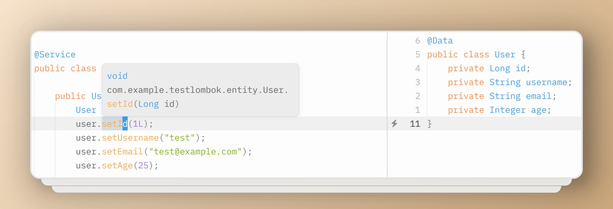

# Zed with jdt-ls and Lombok Support

This guide helps you set up Java Development Tools Language Server (jdt-ls) in Zed with Lombok support.

## How it works

This project extends the original `jdtls.py` script to add Lombok support for Java development in Zed. The key enhancements include:

**Automatic Lombok Integration**: The script automatically locates and configures Lombok JAR in a standardized location:

```py
base_dir = Path(__file__).parent.parent
DEFAULT_LOMBOK_JAR = base_dir / f"extensions/lombok/lombok-{DEFAULT_LOMBOK_VERSION}.jar"

def main(args):
    ...
   
    lombok_jvm_args = [
        f"-javaagent:{known_args.lombok_jar}",
        f"-Xbootclasspath/a:{known_args.lombok_jar}",
        "-Dlog.level=ALL"
    ]
    known_args.jvm_arg = lombok_jvm_args + known_args.jvm_arg

    exec_args = [
        ...
    ] + known_args.jvm_arg + [
        "-jar", str(jar_path),
        "-data", str(jdtls_data_path),
    ] + args
```

## Prerequisites
- [Zed editor](https://zed.dev)
- [Java Development Kit](https://openjdk.org/projects/jdk/21/) (JDK) installed
- [jdt-ls](https://projects.eclipse.org/projects/eclipse.jdt.ls) downloaded

## Installation

1. **Download required files**:
   - [lombok.jar](https://projectlombok.org/download) (official download)
   - `jdtls_lombok` configuration files

2. **Place files in jdt-ls directory**:
   - Copy `lombok-1.18.36.jar` to:
`extensions/lombok/lombok-1.18.36.jar`
(Create the "lombok" directory if it doesn't exist)
   - Place the `jdtls_lombok` configuration files in your jdtls installation folder

## Configuration

Edit your Zed `settings.json` file:

```json
"lsp": {
  "jdtls": {
    "binary": {
      // On Windows
      // "path": "D:\\path\\to\\your\\jdtls\\bin\\jdtls_lombok.bat",
      "path": "/path/to/your/jdtls/bin/jdtls_lombok"
    }
  }
}
```

### Notes:
- Replace `/path/to/your/jdtls/` with your actual jdt-ls installation path
- On Windows, use double backslashes (`\\`) or forward slashes (`/`) for paths
- The Lombok version is typically named `jdtls_lombok.bat` (Windows) or `jdtls_lombok` (macOS/Linux)

## Verification

After setup:
1. Open a Java project with Lombok annotations (you can use the included `test-lombok` project as an example)
2. Verify that:
   - Code completion works
   - Lombok-generated methods are recognized
   - No "cannot resolve symbol" errors appear for Lombok annotations

Here's an example showing Lombok annotations being correctly recognized and parsed:



As shown in the image above, the Lombok annotations are properly processed without any "cannot resolve symbol" errors, and all generated methods are accessible.

## Troubleshooting

If you encounter issues:
1. Ensure Lombok is in your project's dependencies
2. Verify file paths in your configuration
3. Check Zed's logs for any LSP-related errors

## Additional Resources
- [Lombok project](https://projectlombok.org)
- [jdt-ls repository](https://github.com/eclipse/eclipse.jdt.ls)
